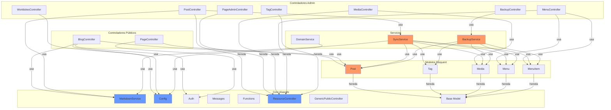

# Plan de Migración Hexagonal: Alxarafe + Chascarrillo

> **Fecha**: 2026-03-29  
> **Alcance**: `alxarafe/alxarafe` (core) + `alxarafe/chascarrillo` (blog app)

---

## 1. Inventario del Código Actual

### 1.1 Chascarrillo — Módulos

| Componente | Archivo | Líneas | Hereda de | Responsabilidades actuales |
|---|---|---|---|---|
| **BlogController** | `Controller/BlogController.php` | 137 | `GenericPublicController` | Listado público de posts con filtros por tag/categoría, paginación, rendering Markdown |
| **PostController** | `Controller/PostController.php` | 262 | `ResourceController` | CRUD de posts, sincronización Markdown, upload de imágenes, renderizado AJAX |
| **PageController** | `Controller/PageController.php` | 76 | `GenericPublicController` | Muestra páginas estáticas públicas, home page con posts recientes |
| **PageAdminController** | `Controller/PageAdminController.php` | 117 | `ResourceController` | CRUD de páginas estáticas (admin) |
| **MediaController** | `Controller/MediaController.php` | 163 | `ResourceController` | CRUD de multimedia, sincronización de archivos físicos |
| **MenuController** | `Controller/MenuController.php` | 141 | `ResourceController` | CRUD de menús y sus items |
| **TagController** | `Controller/TagController.php` | 83 | `ResourceController` | CRUD de tags y categorías |
| **BackupController** | `Controller/BackupController.php` | 96 | `Controller` | Export/import ZIP, reset DB desde Content |
| **WorldsitesController** | `Controller/WorldsitesController.php` | 135 | `ResourceController` | Configuración multi-dominio |
| **ThemeController** | `Controller/ThemeController.php` | ~50 | `Controller` | Selección de tema visual |
| **MaintenanceController** | `Controller/MaintenanceController.php` | ~45 | `Controller` | Modo mantenimiento |

### 1.2 Chascarrillo — Modelos (Eloquent)

| Modelo | Tabla | Campos clave | Lógica de negocio mezclada |
|---|---|---|---|
| `Post` | `posts` | title, slug, type, content, is_published, status | `getExcerpt()`, `getRenderedContent()`, `getUrl()`, `getMenuPages()`, Workflow |
| `Tag` | `tags` | name, slug, type | Relación posts (BelongsToMany) |
| `Media` | `media` | filename, type, path, size | `getUrl()` |
| `Menu` | `menus` | name, slug | `getBySlug()`, items relation |
| `MenuItem` | `menu_items` | label, url, icon, order, parent_id | parent/children relations |

### 1.3 Chascarrillo — Servicios

| Servicio | Líneas | Responsabilidades |
|---|---|---|
| `SyncService` | 297 | Sincroniza archivos Markdown → DB (posts/pages), assets, menús, tags |
| `BackupService` | 226 | Export/import ZIP, reset DB, reconstruir Content desde DB |
| `DomainService` | 151 | Detección de idioma del navegador, sugerencia multi-dominio, hreflang |
| `UpdateService` | ~150 | Actualizaciones del sistema |

### 1.4 Dependencias del Core Usadas

| Clase del Core | Usado en | Tipo de acoplamiento |
|---|---|---|
| `MarkdownService` | BlogController, PostController, SyncService, Post model | Estático directo |
| `Config::getConfig()` | BlogController, PageController, DomainService, WorldsitesController | Estático directo |
| `Auth::$user` | BlogController, PageController | Variable global estática |
| `Messages::addError/addMessage` | BackupController, MediaController, PostController | Estático directo |
| `Functions::httpRedirect` | BackupController, PageController, MediaController | Estático directo |
| `Trans::_()` | HasWorkflow, WorldsitesController | Estático directo |
| `ResourceController` / `GenericPublicController` | 9 controladores | Herencia profunda |
| `Model` (Eloquent base) | 5 modelos | Herencia directa |

### 1.5 Mapa de Acoplamiento



**Rojo**: Clases con mayor acoplamiento. **Azul**: Dependencias del core.

---

## 2. Diseño Hexagonal Propuesto

### 2.1 Entidades de Dominio Identificadas

| Entidad | Value Objects | Reglas de negocio |
|---|---|---|
| `Post` | `Slug`, `PostType` (enum), `SeoMetadata` | Workflow (borrador→validado→publicado→archivado), generación de excerpt, URL pública |
| `Tag` | `Slug`, `TagType` (enum: tag/category) | Relación N:M con Post |
| `MediaAsset` | `FilePath`, `MimeType` | Generación de URL pública |
| `SiteMenu` | — | Generación automática desde páginas marcadas `in_menu` |
| `SiteMenuItem` | — | Jerarquía padre-hijo, ordenación |

### 2.2 Puertos Identificados

#### Puertos de Entrada (Casos de Uso)

| Puerto | Descripción |
|---|---|
| `ListPublishedPostsPort` | Listar posts publicados con filtros (tag, categoría, paginación) |
| `ShowPostPort` | Mostrar un post/página por slug |
| `CreatePostPort` | Crear un nuevo post/página |
| `UpdatePostPort` | Actualizar un post/página existente |
| `DeletePostPort` | Eliminar un post |
| `TransitionPostWorkflowPort` | Cambiar estado del workflow |
| `SyncContentPort` | Sincronizar archivos Markdown con la base de datos |
| `ManageTagsPort` | CRUD de tags/categorías |
| `ManageMediaPort` | CRUD y sincronización de multimedia |
| `ManageMenuPort` | CRUD de menús y sus items |
| `ExportContentPort` | Exportar contenido a ZIP |
| `ImportContentPort` | Importar contenido desde ZIP |
| `DetectDomainSuggestionPort` | Detectar idioma y sugerir dominio alternativo |

#### Puertos de Salida (Infraestructura)

| Puerto | Descripción |
|---|---|
| `PostRepositoryPort` | Persistencia de posts (CRUD + queries) |
| `TagRepositoryPort` | Persistencia de tags |
| `MediaRepositoryPort` | Persistencia de registros multimedia |
| `MenuRepositoryPort` | Persistencia de menús e items |
| `MarkdownRendererPort` | Renderizar Markdown a HTML |
| `MarkdownParserPort` | Parsear archivos .md con front-matter |
| `FileSystemPort` | Operaciones sobre el sistema de archivos |
| `ConfigurationPort` | Lectura/escritura de configuración |
| `ArchivePort` | Crear/extraer archivos ZIP |
| `AuthContextPort` | Obtener usuario autenticado actual |

### 2.3 Estructura de Directorios Propuesta

```
Modules/Chascarrillo/
├── Domain/                              ← SIN dependencias externas
│   ├── Entity/
│   │   ├── Post.php                     ← POJO puro con lógica de negocio
│   │   ├── Tag.php
│   │   ├── MediaAsset.php
│   │   ├── SiteMenu.php
│   │   └── SiteMenuItem.php
│   ├── ValueObject/
│   │   ├── Slug.php
│   │   ├── PostType.php                 ← Enum: post, page
│   │   ├── TagType.php                  ← Enum: tag, category
│   │   ├── SeoMetadata.php
│   │   ├── PostStatus.php               ← Enum: draft(0), validated(1), published(2), archived(9)
│   │   └── FilePath.php
│   ├── Port/
│   │   ├── In/
│   │   │   ├── ListPublishedPostsPort.php
│   │   │   ├── ShowPostPort.php
│   │   │   ├── CreatePostPort.php
│   │   │   ├── UpdatePostPort.php
│   │   │   ├── SyncContentPort.php
│   │   │   ├── ExportContentPort.php
│   │   │   └── ImportContentPort.php
│   │   └── Out/
│   │       ├── PostRepositoryPort.php
│   │       ├── TagRepositoryPort.php
│   │       ├── MediaRepositoryPort.php
│   │       ├── MenuRepositoryPort.php
│   │       ├── MarkdownRendererPort.php
│   │       ├── MarkdownParserPort.php
│   │       ├── FileSystemPort.php
│   │       ├── ConfigurationPort.php
│   │       ├── ArchivePort.php
│   │       └── AuthContextPort.php
│   ├── Service/
│   │   ├── PostWorkflowService.php      ← Máquina de estados pura
│   │   ├── ExcerptGenerator.php
│   │   ├── SlugGenerator.php
│   │   └── MenuBuilder.php             ← Construye menú desde páginas
│   └── Exception/
│       ├── PostNotFoundException.php
│       ├── InvalidTransitionException.php
│       └── ContentSyncException.php
│
├── Application/                         ← Orquestación
│   ├── UseCase/
│   │   ├── ListPublishedPostsUseCase.php
│   │   ├── ShowPostUseCase.php
│   │   ├── CreatePostUseCase.php
│   │   ├── UpdatePostUseCase.php
│   │   ├── SyncContentUseCase.php
│   │   ├── ExportContentUseCase.php
│   │   ├── ImportContentUseCase.php
│   │   └── BuildMenuUseCase.php
│   └── DTO/
│       ├── PostListRequest.php
│       ├── PostListResponse.php
│       ├── PostDetailResponse.php
│       ├── CreatePostRequest.php
│       ├── UpdatePostRequest.php
│       └── SyncResultResponse.php
│
├── Infrastructure/                      ← Adaptadores de salida
│   ├── Persistence/
│   │   ├── Eloquent/
│   │   │   ├── EloquentPostRepository.php
│   │   │   ├── EloquentTagRepository.php
│   │   │   ├── EloquentMediaRepository.php
│   │   │   ├── EloquentMenuRepository.php
│   │   │   └── Model/                   ← Modelos Eloquent (solo persistencia)
│   │   │       ├── PostEloquentModel.php
│   │   │       ├── TagEloquentModel.php
│   │   │       ├── MediaEloquentModel.php
│   │   │       ├── MenuEloquentModel.php
│   │   │       └── MenuItemEloquentModel.php
│   │   └── InMemory/                    ← Para tests
│   │       ├── InMemoryPostRepository.php
│   │       └── InMemoryTagRepository.php
│   ├── Markdown/
│   │   └── ParsedownMarkdownAdapter.php
│   ├── FileSystem/
│   │   └── LocalFileSystemAdapter.php
│   ├── Archive/
│   │   └── ZipArchiveAdapter.php
│   ├── Auth/
│   │   └── AlxarafeAuthAdapter.php
│   └── Config/
│       └── JsonConfigAdapter.php
│
├── Controller/                          ← Adaptadores de entrada (delgados)
│   ├── BlogController.php
│   ├── PostController.php
│   ├── PageController.php
│   ├── PageAdminController.php
│   ├── MediaController.php
│   ├── MenuController.php
│   ├── TagController.php
│   ├── BackupController.php
│   └── WorldsitesController.php
│
├── Lang/
├── Migrations/
├── Seeders/
└── Templates/
```

---

## 3. Ejemplos de Código por Capa

### 3.1 Capa de Dominio — Entidad Post

```php
// Modules/Chascarrillo/Domain/Entity/Post.php
namespace Modules\Chascarrillo\Domain\Entity;

use Modules\Chascarrillo\Domain\ValueObject\PostStatus;
use Modules\Chascarrillo\Domain\ValueObject\PostType;
use Modules\Chascarrillo\Domain\ValueObject\Slug;
use Modules\Chascarrillo\Domain\ValueObject\SeoMetadata;
use Modules\Chascarrillo\Domain\Exception\InvalidTransitionException;

class Post
{
    private ?int $id;
    private string $title;
    private Slug $slug;
    private PostType $type;
    private ?string $content;
    private PostStatus $status;
    private bool $isPublished;
    private ?\DateTimeImmutable $publishedAt;
    private ?string $featuredImage;
    private SeoMetadata $seo;
    private bool $inMenu;
    private ?string $menuLabel;
    private int $menuOrder;
    /** @var int[] */
    private array $tagIds = [];
    /** @var int[] */
    private array $categoryIds = [];

    public function __construct(
        string $title,
        Slug $slug,
        PostType $type,
        ?string $content = null,
        ?PostStatus $status = null,
        bool $isPublished = false,
        ?\DateTimeImmutable $publishedAt = null,
        ?string $featuredImage = null,
        ?SeoMetadata $seo = null,
        bool $inMenu = false,
        ?string $menuLabel = null,
        int $menuOrder = 0,
        ?int $id = null,
    ) {
        $this->id = $id;
        $this->title = $title;
        $this->slug = $slug;
        $this->type = $type;
        $this->content = $content;
        $this->status = $status ?? PostStatus::Draft;
        $this->isPublished = $isPublished;
        $this->publishedAt = $publishedAt;
        $this->featuredImage = $featuredImage;
        $this->seo = $seo ?? SeoMetadata::empty();
        $this->inMenu = $inMenu;
        $this->menuLabel = $menuLabel;
        $this->menuOrder = $menuOrder;
    }

    // — Lógica de negocio (antes mezclada en el modelo Eloquent y HasWorkflow) —

    public function canTransitionTo(PostStatus $target): bool
    {
        $allowed = match ($this->status) {
            PostStatus::Draft     => [PostStatus::Validated, PostStatus::Archived],
            PostStatus::Validated => [PostStatus::Published, PostStatus::Draft],
            PostStatus::Published => [PostStatus::Validated, PostStatus::Archived],
            PostStatus::Archived  => [PostStatus::Draft],
        };
        return in_array($target, $allowed, true);
    }

    public function transitionTo(PostStatus $target): void
    {
        if (!$this->canTransitionTo($target)) {
            throw InvalidTransitionException::fromStates($this->status, $target);
        }
        $this->status = $target;

        if ($target === PostStatus::Published && $this->publishedAt === null) {
            $this->publishedAt = new \DateTimeImmutable();
            $this->isPublished = true;
        }
    }

    public function getExcerpt(int $maxLength = 140): string
    {
        $text = strip_tags($this->content ?? '');
        return mb_strlen($text) > $maxLength
            ? mb_substr($text, 0, $maxLength) . '…'
            : $text;
    }

    public function getPublicUrl(): string
    {
        return $this->type === PostType::Page
            ? '/' . $this->slug->value()
            : '/blog/' . $this->slug->value();
    }

    public function isVisibleTo(bool $isAdmin): bool
    {
        if ($isAdmin) return true;
        return $this->isPublished
            && $this->publishedAt !== null
            && $this->publishedAt <= new \DateTimeImmutable();
    }

    // Getters...
    public function getId(): ?int { return $this->id; }
    public function getTitle(): string { return $this->title; }
    public function getSlug(): Slug { return $this->slug; }
    public function getType(): PostType { return $this->type; }
    public function getContent(): ?string { return $this->content; }
    public function getStatus(): PostStatus { return $this->status; }
    public function isPublished(): bool { return $this->isPublished; }
    public function getPublishedAt(): ?\DateTimeImmutable { return $this->publishedAt; }
    public function getSeo(): SeoMetadata { return $this->seo; }
    public function isInMenu(): bool { return $this->inMenu; }
    public function getMenuLabel(): ?string { return $this->menuLabel; }
    public function getMenuOrder(): int { return $this->menuOrder; }
    public function getFeaturedImage(): ?string { return $this->featuredImage; }
    public function getTagIds(): array { return $this->tagIds; }
    public function getCategoryIds(): array { return $this->categoryIds; }

    public function setTagIds(array $ids): void { $this->tagIds = $ids; }
    public function setCategoryIds(array $ids): void { $this->categoryIds = $ids; }
}
```

### 3.2 Capa de Dominio — Value Objects

```php
// Modules/Chascarrillo/Domain/ValueObject/PostStatus.php
namespace Modules\Chascarrillo\Domain\ValueObject;

enum PostStatus: int
{
    case Draft     = 0;
    case Validated = 1;
    case Published = 2;
    case Archived  = 9;

    public function label(): string
    {
        return match ($this) {
            self::Draft     => 'Borrador',
            self::Validated => 'Validado',
            self::Published => 'Publicado',
            self::Archived  => 'Archivado',
        };
    }
}

// Modules/Chascarrillo/Domain/ValueObject/PostType.php
enum PostType: string
{
    case Post = 'post';
    case Page = 'page';
}

// Modules/Chascarrillo/Domain/ValueObject/Slug.php
final class Slug
{
    public function __construct(private readonly string $slug) {
        if (!preg_match('/^[a-z0-9\-]+$/', $slug)) {
            throw new \InvalidArgumentException("Slug inválido: $slug");
        }
    }
    public function value(): string { return $this->slug; }
    public function __toString(): string { return $this->slug; }
}

// Modules/Chascarrillo/Domain/ValueObject/SeoMetadata.php
final class SeoMetadata
{
    public function __construct(
        public readonly ?string $metaTitle = null,
        public readonly ?string $metaDescription = null,
        public readonly ?string $metaKeywords = null,
    ) {}
    public static function empty(): self { return new self(); }
}
```

### 3.3 Capa de Dominio — Puertos de Salida

```php
// Modules/Chascarrillo/Domain/Port/Out/PostRepositoryPort.php
namespace Modules\Chascarrillo\Domain\Port\Out;

use Modules\Chascarrillo\Domain\Entity\Post;
use Modules\Chascarrillo\Domain\ValueObject\PostType;
use Modules\Chascarrillo\Domain\ValueObject\Slug;

interface PostRepositoryPort
{
    public function findById(int $id): ?Post;
    public function findBySlug(Slug $slug): ?Post;
    /** @return Post[] */
    public function findPublished(PostType $type, int $limit, int $offset = 0,
                                   ?string $tagSlug = null, ?string $categorySlug = null): array;
    public function countPublished(PostType $type, ?string $tagSlug = null,
                                    ?string $categorySlug = null): int;
    /** @return Post[] */
    public function findAll(PostType $type): array;
    public function save(Post $post): void;
    public function delete(int $id): void;
}

// Modules/Chascarrillo/Domain/Port/Out/MarkdownRendererPort.php
interface MarkdownRendererPort
{
    public function render(string $markdown): string;
}

// Modules/Chascarrillo/Domain/Port/Out/FileSystemPort.php
interface FileSystemPort
{
    /** @return string[] */
    public function listFiles(string $directory, string $extension = '*'): array;
    public function readFile(string $path): string;
    public function writeFile(string $path, string $content): void;
    public function copyFile(string $source, string $target): void;
    public function deleteDirectory(string $path): void;
    public function ensureDirectory(string $path): void;
    public function exists(string $path): bool;
    public function fileSize(string $path): int;
    public function mimeType(string $path): ?string;
    public function lastModified(string $path): int;
}
```

### 3.4 Capa de Aplicación — Caso de Uso

```php
// Modules/Chascarrillo/Application/UseCase/ListPublishedPostsUseCase.php
namespace Modules\Chascarrillo\Application\UseCase;

use Modules\Chascarrillo\Application\DTO\PostListRequest;
use Modules\Chascarrillo\Application\DTO\PostListResponse;
use Modules\Chascarrillo\Domain\Port\In\ListPublishedPostsPort;
use Modules\Chascarrillo\Domain\Port\Out\PostRepositoryPort;
use Modules\Chascarrillo\Domain\Port\Out\MarkdownRendererPort;
use Modules\Chascarrillo\Domain\Port\Out\ConfigurationPort;
use Modules\Chascarrillo\Domain\ValueObject\PostType;

class ListPublishedPostsUseCase implements ListPublishedPostsPort
{
    public function __construct(
        private PostRepositoryPort $postRepository,
        private MarkdownRendererPort $markdownRenderer,
        private ConfigurationPort $config,
    ) {}

    public function execute(PostListRequest $request): PostListResponse
    {
        $postsPerPage = $this->config->get('blog.posts_per_page', 10);

        $posts = $this->postRepository->findPublished(
            type: PostType::Post,
            limit: $postsPerPage,
            offset: ($request->page - 1) * $postsPerPage,
            tagSlug: $request->tagSlug,
            categorySlug: $request->categorySlug,
        );

        $total = $this->postRepository->countPublished(
            PostType::Post, $request->tagSlug, $request->categorySlug
        );

        // Render content for posts without meta_description (for excerpt)
        $postDtos = array_map(function ($post) {
            $renderedContent = null;
            if (empty($post->getSeo()->metaDescription)) {
                $renderedContent = $this->markdownRenderer->render($post->getContent() ?? '');
            }
            return PostListResponse\PostItem::fromEntity($post, $renderedContent);
        }, $posts);

        return new PostListResponse($postDtos, $total, $request->page, $postsPerPage);
    }
}
```

### 3.5 Capa de Infraestructura — Adaptador Eloquent

```php
// Modules/Chascarrillo/Infrastructure/Persistence/Eloquent/EloquentPostRepository.php
namespace Modules\Chascarrillo\Infrastructure\Persistence\Eloquent;

use Modules\Chascarrillo\Domain\Entity\Post;
use Modules\Chascarrillo\Domain\Port\Out\PostRepositoryPort;
use Modules\Chascarrillo\Domain\ValueObject\{PostType, PostStatus, Slug, SeoMetadata};
use Modules\Chascarrillo\Infrastructure\Persistence\Eloquent\Model\PostEloquentModel;

class EloquentPostRepository implements PostRepositoryPort
{
    public function findBySlug(Slug $slug): ?Post
    {
        $model = PostEloquentModel::where('slug', $slug->value())->first();
        return $model ? $this->toDomain($model) : null;
    }

    public function findPublished(PostType $type, int $limit, int $offset = 0,
                                   ?string $tagSlug = null, ?string $categorySlug = null): array
    {
        $query = PostEloquentModel::where('type', $type->value)
            ->where('is_published', true)
            ->where('published_at', '<=', now())
            ->orderBy('published_at', 'DESC');

        if ($tagSlug) {
            $query->whereHas('tags', fn($q) => $q->where('slug', $tagSlug)->where('type', 'tag'));
        }
        if ($categorySlug) {
            $query->whereHas('tags', fn($q) => $q->where('slug', $categorySlug)->where('type', 'category'));
        }

        return $query->skip($offset)->take($limit)->get()
            ->map(fn($m) => $this->toDomain($m))->all();
    }

    public function save(Post $post): void
    {
        $model = $post->getId()
            ? PostEloquentModel::findOrNew($post->getId())
            : new PostEloquentModel();

        $model->title = $post->getTitle();
        $model->slug = $post->getSlug()->value();
        $model->type = $post->getType()->value;
        $model->content = $post->getContent();
        $model->status = $post->getStatus()->value;
        $model->is_published = $post->isPublished();
        $model->published_at = $post->getPublishedAt();
        $model->featured_image = $post->getFeaturedImage();
        $model->meta_title = $post->getSeo()->metaTitle;
        $model->meta_description = $post->getSeo()->metaDescription;
        $model->meta_keywords = $post->getSeo()->metaKeywords;
        $model->in_menu = $post->isInMenu();
        $model->menu_label = $post->getMenuLabel();
        $model->menu_order = $post->getMenuOrder();
        $model->save();

        // Sync tags
        $allTagIds = array_merge($post->getTagIds(), $post->getCategoryIds());
        $model->tags()->sync($allTagIds);
    }

    private function toDomain(PostEloquentModel $model): Post
    {
        $post = new Post(
            title: $model->title,
            slug: new Slug($model->slug),
            type: PostType::from($model->type),
            content: $model->content,
            status: PostStatus::from($model->status),
            isPublished: (bool) $model->is_published,
            publishedAt: $model->published_at
                ? \DateTimeImmutable::createFromMutable($model->published_at->toDateTime()) : null,
            featuredImage: $model->featured_image,
            seo: new SeoMetadata($model->meta_title, $model->meta_description, $model->meta_keywords),
            inMenu: (bool) $model->in_menu,
            menuLabel: $model->menu_label,
            menuOrder: (int) $model->menu_order,
            id: $model->id,
        );
        $post->setTagIds($model->tags()->where('type', 'tag')->pluck('tags.id')->toArray());
        $post->setCategoryIds($model->tags()->where('type', 'category')->pluck('tags.id')->toArray());
        return $post;
    }

    // ... countPublished(), findAll(), findById(), delete() ...
}
```

### 3.6 Controlador Refactorizado (Delgado)

```php
// Modules/Chascarrillo/Controller/BlogController.php — REFACTORIZADO
namespace Modules\Chascarrillo\Controller;

use Alxarafe\Base\Controller\GenericPublicController;
use Modules\Chascarrillo\Application\DTO\PostListRequest;
use Modules\Chascarrillo\Domain\Port\In\ListPublishedPostsPort;
use Modules\Chascarrillo\Domain\Port\In\ShowPostPort;

class BlogController extends GenericPublicController
{
    private ListPublishedPostsPort $listPosts;
    private ShowPostPort $showPost;

    public function __construct(?string $action = null, mixed $data = null)
    {
        parent::__construct($action, $data);
        // DI (manual hasta que haya contenedor)
        $this->listPosts = Container::get(ListPublishedPostsPort::class);
        $this->showPost = Container::get(ShowPostPort::class);
    }

    public function doIndex(): bool
    {
        $request = new PostListRequest(
            page: (int)($_GET['page'] ?? 1),
            tagSlug: $_GET['tag'] ?? null,
            categorySlug: $_GET['category'] ?? null,
        );

        $response = $this->listPosts->execute($request);

        $this->title = $response->title;
        $this->addVariable('posts', $response->posts);
        $this->addVariable('pagination', $response->pagination());
        $this->setDefaultTemplate('blog/index');
        return true;
    }

    public function doShow(): bool
    {
        $slug = $_GET['slug'] ?? '';
        $response = $this->showPost->execute($slug);

        if (!$response) {
            \Alxarafe\Lib\Functions::httpRedirect('/');
            return false;
        }

        $this->title = $response->title;
        $this->addVariable('post', $response);
        $this->addVariable('content', $response->renderedContent);
        $this->setDefaultTemplate('blog/show');
        return true;
    }
}
```

---

## 4. Plan de Migración Fase a Fase

### Fase 0: Preparación del Core (1-2 semanas)

**Objetivo**: Crear los puertos genéricos en `alxarafe/alxarafe` que Chascarrillo usará.

| Archivo | Acción | Descripción |
|---|---|---|
| `src/Domain/Port/Out/MarkdownRendererPort.php` | **[NEW]** | Interfaz para renderizar Markdown |
| `src/Domain/Port/Out/ConfigurationPort.php` | **[NEW]** | Interfaz para leer configuración |
| `src/Domain/Port/Out/AuthContextPort.php` | **[NEW]** | Interfaz para obtener el usuario actual |
| `src/Domain/Port/Out/FileSystemPort.php` | **[NEW]** | Interfaz para operaciones de archivos |
| `src/Infrastructure/Markdown/ParsedownAdapter.php` | **[NEW]** | Adaptador que usa el `MarkdownService` actual |
| `src/Infrastructure/Config/JsonConfigAdapter.php` | **[NEW]** | Adaptador que usa `Config::getConfig()` |
| `src/Infrastructure/Auth/SessionAuthAdapter.php` | **[NEW]** | Adaptador que usa `Auth::$user` |
| `src/Infrastructure/FileSystem/LocalAdapter.php` | **[NEW]** | Adaptador de filesystem local |

> Estos puertos son reutilizables por todos los repositorios (alixar, labtrack, etc.).

### Fase 1: Dominio del Post (2-3 semanas)

**Objetivo**: Extraer la lógica de negocio del modelo `Post` a entidades y value objects puros.

| Paso | Archivo origen | Archivo destino | Qué se mueve |
|---|---|---|---|
| 1.1 | — | `Domain/ValueObject/PostStatus.php` | Enum con estados y labels |
| 1.2 | — | `Domain/ValueObject/PostType.php` | Enum post/page |
| 1.3 | — | `Domain/ValueObject/Slug.php` | VO con validación |
| 1.4 | — | `Domain/ValueObject/SeoMetadata.php` | VO inmutable |
| 1.5 | `Model/Post.php` | `Domain/Entity/Post.php` | `getExcerpt()`, `getUrl()`, workflow logic |
| 1.6 | `Traits/HasWorkflow.php` | `Domain/Service/PostWorkflowService.php` | `canTransition()`, `transition()`, estados |
| 1.7 | — | `Domain/Port/Out/PostRepositoryPort.php` | Interfaz del repositorio |
| 1.8 | — | `Domain/Port/Out/TagRepositoryPort.php` | Interfaz del repositorio |
| 1.9 | `Model/Post.php` | `Infrastructure/.../PostEloquentModel.php` | Solo `$table`, `$fillable`, `$casts`, relaciones |
| 1.10 | — | `Infrastructure/.../EloquentPostRepository.php` | Implementación con mapeo Entity↔Model |

**Tests**: Crear `Tests/Domain/Entity/PostTest.php` para testear workflow transitions, `getExcerpt()`, `isVisibleTo()`, `getPublicUrl()` — todo sin DB.

### Fase 2: Casos de Uso del Blog (2 semanas)

**Objetivo**: Crear los casos de uso para las operaciones públicas del blog.

| Paso | Archivo | Descripción |
|---|---|---|
| 2.1 | `Application/DTO/PostListRequest.php` | Request DTO (page, tagSlug, categorySlug) |
| 2.2 | `Application/DTO/PostListResponse.php` | Response DTO (posts, total, pagination) |
| 2.3 | `Application/DTO/PostDetailResponse.php` | Response DTO (post detail + rendered content) |
| 2.4 | `Application/UseCase/ListPublishedPostsUseCase.php` | Orquesta PostRepository + MarkdownRenderer |
| 2.5 | `Application/UseCase/ShowPostUseCase.php` | Busca por slug, verifica visibilidad |
| 2.6 | Refactorizar `Controller/BlogController.php` | Hacerlo delgado, delegando a use cases |
| 2.7 | Refactorizar `Controller/PageController.php` | Idem |

**Tests**: `Tests/Application/UseCase/ListPublishedPostsUseCaseTest.php` con `InMemoryPostRepository`.

### Fase 3: CRUD Admin — Post y Page (2 semanas)

**Objetivo**: Migrar lógica CRUD de `PostController` y `PageAdminController`.

| Paso | Archivo | Descripción |
|---|---|---|
| 3.1 | `Application/UseCase/CreatePostUseCase.php` | Crear post con validación, slug auto, tags |
| 3.2 | `Application/UseCase/UpdatePostUseCase.php` | Actualizar post + sync tags |
| 3.3 | `Application/DTO/CreatePostRequest.php` | Request DTO desde formulario |
| 3.4 | `Application/DTO/UpdatePostRequest.php` | Request DTO de actualización |
| 3.5 | Refactorizar `Controller/PostController.php` | Delegar CRUD a use cases |
| 3.6 | Refactorizar `Controller/PageAdminController.php` | Idem |

### Fase 4: SyncService y BackupService (2-3 semanas)

**Objetivo**: Desacoplar los servicios complejos de infraestructura.

| Paso | Archivo origen | Archivo destino | Descripción |
|---|---|---|---|
| 4.1 | — | `Domain/Port/Out/MarkdownParserPort.php` | Interfaz para parsear .md con front-matter |
| 4.2 | — | `Domain/Port/Out/ArchivePort.php` | Interfaz para crear/extraer ZIP |
| 4.3 | `Service/SyncService.php` | `Application/UseCase/SyncContentUseCase.php` | Orquesta FileSystem + MarkdownParser + PostRepo |
| 4.4 | `Service/BackupService.php` | `Application/UseCase/ExportContentUseCase.php` | Orquesta FileSystem + ArchivePort + PostRepo |
| 4.5 | `Service/BackupService.php` | `Application/UseCase/ImportContentUseCase.php` | Orquesta ArchivePort + FileSystem + Config |
| 4.6 | — | `Infrastructure/Archive/ZipArchiveAdapter.php` | Implementación con `ZipArchive` |
| 4.7 | — | `Infrastructure/Markdown/ParsedownParserAdapter.php` | Implementación con `MarkdownService::parse()` |
| 4.8 | Refactorizar `Controller/BackupController.php` | — | Delegar a use cases |

### Fase 5: Media, Menu, Tag, Domain (1-2 semanas)

**Objetivo**: Migrar las entidades secundarias.

| Paso | Descripción |
|---|---|
| 5.1 | Crear `Domain/Entity/Tag.php`, `Domain/Entity/MediaAsset.php` |
| 5.2 | Crear `Domain/Entity/SiteMenu.php`, `Domain/Entity/SiteMenuItem.php` |
| 5.3 | Crear repositorios Eloquent para cada entidad |
| 5.4 | Crear use cases: `ManageTagsUseCase`, `SyncMediaUseCase`, `BuildMenuUseCase` |
| 5.5 | Refactorizar `MediaController`, `MenuController`, `TagController` |
| 5.6 | Mover `DomainService` → `Application/UseCase/DetectDomainSuggestionUseCase.php` |

### Fase 6: InMemory Repositories y Tests (1-2 semanas)

| Paso | Descripción |
|---|---|
| 6.1 | Crear `Infrastructure/InMemory/InMemoryPostRepository.php` |
| 6.2 | Crear `Infrastructure/InMemory/InMemoryTagRepository.php` |
| 6.3 | Tests unitarios: `PostTest`, `PostWorkflowServiceTest`, `SlugTest` |
| 6.4 | Tests de aplicación: `ListPublishedPostsUseCaseTest`, `SyncContentUseCaseTest` |
| 6.5 | Tests de integración: `EloquentPostRepositoryTest` (SQLite in-memory) |

### Fase 7: Limpieza y Deprecación (1 semana)

| Paso | Descripción |
|---|---|
| 7.1 | Marcar modelos Eloquent antiguos como `@deprecated` |
| 7.2 | Mover `HasWorkflow` trait a legacy |
| 7.3 | Eliminar lógica de negocio de los modelos Eloquent |
| 7.4 | Actualizar `routes.php` para usar el nuevo flujo |
| 7.5 | Actualizar documentación del módulo |

---

## 5. Cambios Necesarios en el Core (`alxarafe/alxarafe`)

### 5.1 Nuevos Archivos en el Core

```
src/
├── Domain/
│   └── Port/
│       └── Out/
│           ├── MarkdownRendererPort.php
│           ├── MarkdownParserPort.php
│           ├── ConfigurationPort.php
│           ├── AuthContextPort.php
│           ├── FileSystemPort.php
│           └── ArchivePort.php
├── Infrastructure/
│   ├── Markdown/
│   │   ├── ParsedownRendererAdapter.php   ← implementa MarkdownRendererPort
│   │   └── ParsedownParserAdapter.php     ← implementa MarkdownParserPort
│   ├── Config/
│   │   └── JsonConfigAdapter.php          ← implementa ConfigurationPort
│   ├── Auth/
│   │   └── SessionAuthAdapter.php         ← implementa AuthContextPort
│   ├── FileSystem/
│   │   └── LocalFileSystemAdapter.php     ← implementa FileSystemPort
│   └── Archive/
│       └── ZipArchiveAdapter.php          ← implementa ArchivePort
└── Container/
    └── ServiceContainer.php               ← Contenedor DI mínimo
```

### 5.2 Contenedor de Inyección de Dependencias (Mínimo)

```php
// src/Container/ServiceContainer.php
namespace Alxarafe\Container;

class ServiceContainer
{
    private static array $bindings = [];
    private static array $instances = [];

    public static function bind(string $interface, string|callable $concrete): void
    {
        self::$bindings[$interface] = $concrete;
    }

    public static function get(string $interface): mixed
    {
        if (isset(self::$instances[$interface])) {
            return self::$instances[$interface];
        }
        $concrete = self::$bindings[$interface] ?? $interface;
        $instance = is_callable($concrete) ? $concrete() : new $concrete();
        self::$instances[$interface] = $instance;
        return $instance;
    }
}
```

### 5.3 Registro de Bindings (Bootstrap)

```php
// En el bootstrap de Chascarrillo o en un ServiceProvider
use Alxarafe\Container\ServiceContainer;
use Modules\Chascarrillo\Domain\Port\Out\*;
use Modules\Chascarrillo\Infrastructure\Persistence\Eloquent\*;

// Puertos genéricos del core
ServiceContainer::bind(MarkdownRendererPort::class, ParsedownRendererAdapter::class);
ServiceContainer::bind(ConfigurationPort::class, JsonConfigAdapter::class);
ServiceContainer::bind(AuthContextPort::class, SessionAuthAdapter::class);
ServiceContainer::bind(FileSystemPort::class, LocalFileSystemAdapter::class);
ServiceContainer::bind(ArchivePort::class, ZipArchiveAdapter::class);

// Puertos específicos de Chascarrillo
ServiceContainer::bind(PostRepositoryPort::class, EloquentPostRepository::class);
ServiceContainer::bind(TagRepositoryPort::class, EloquentTagRepository::class);
ServiceContainer::bind(MediaRepositoryPort::class, EloquentMediaRepository::class);
ServiceContainer::bind(MenuRepositoryPort::class, EloquentMenuRepository::class);

// Puertos de entrada (casos de uso)
ServiceContainer::bind(ListPublishedPostsPort::class, fn() => new ListPublishedPostsUseCase(
    ServiceContainer::get(PostRepositoryPort::class),
    ServiceContainer::get(MarkdownRendererPort::class),
    ServiceContainer::get(ConfigurationPort::class),
));
```

---

## 6. Estrategia de Tests

### 6.1 Pirámide de Tests

```
         ┌─────────────┐
         │  E2E / UI   │  ← Browser tests (existentes)
         │   (pocos)   │
         ├─────────────┤
         │ Integración │  ← EloquentRepo + SQLite in-memory
         │  (algunos)  │
         ├─────────────┤
         │  Unitarios  │  ← Entidades, VOs, UseCases con InMemoryRepos
         │  (muchos)   │
         └─────────────┘
```

### 6.2 Ejemplo de Test Unitario

```php
// Tests/Domain/Entity/PostTest.php
class PostTest extends TestCase
{
    public function test_can_transition_from_draft_to_validated(): void
    {
        $post = $this->createDraftPost();
        $this->assertTrue($post->canTransitionTo(PostStatus::Validated));
    }

    public function test_cannot_transition_from_draft_to_published(): void
    {
        $post = $this->createDraftPost();
        $this->assertFalse($post->canTransitionTo(PostStatus::Published));
    }

    public function test_transition_to_published_sets_published_at(): void
    {
        $post = $this->createDraftPost();
        $post->transitionTo(PostStatus::Validated);
        $post->transitionTo(PostStatus::Published);
        $this->assertNotNull($post->getPublishedAt());
        $this->assertTrue($post->isPublished());
    }

    public function test_get_excerpt_truncates_content(): void
    {
        $post = new Post(title: 'Test', slug: new Slug('test'),
            type: PostType::Post, content: str_repeat('a', 200));
        $this->assertEquals(143, mb_strlen($post->getExcerpt(140)));
    }

    public function test_page_url_is_different_from_post_url(): void
    {
        $page = new Post(title: 'About', slug: new Slug('about'), type: PostType::Page);
        $post = new Post(title: 'Hello', slug: new Slug('hello'), type: PostType::Post);
        $this->assertEquals('/about', $page->getPublicUrl());
        $this->assertEquals('/blog/hello', $post->getPublicUrl());
    }

    private function createDraftPost(): Post
    {
        return new Post(title: 'Test', slug: new Slug('test'),
            type: PostType::Post, content: 'Hello world');
    }
}
```

---

## 7. Cronograma Resumido

| Fase | Duración | Dependencias | Entregable |
|---|---|---|---|
| **Fase 0**: Puertos en Core | 1-2 sem | — | Interfaces + adaptadores en `alxarafe` |
| **Fase 1**: Dominio del Post | 2-3 sem | Fase 0 | Entity, VOs, PostRepositoryPort, EloquentPostRepo |
| **Fase 2**: Use Cases Blog | 2 sem | Fase 1 | ListPosts, ShowPost + Controllers refactorizados |
| **Fase 3**: CRUD Admin | 2 sem | Fase 1 | CreatePost, UpdatePost + Controllers refactorizados |
| **Fase 4**: Sync + Backup | 2-3 sem | Fases 1-3 | SyncContentUseCase, Export/ImportUseCase |
| **Fase 5**: Entidades secundarias | 1-2 sem | Fase 1 | Tag, Media, Menu migrados |
| **Fase 6**: Tests completos | 1-2 sem | Fases 1-5 | Suite de tests unitarios e integración |
| **Fase 7**: Limpieza | 1 sem | Fases 1-6 | Legacy eliminado, docs actualizados |
| **TOTAL** | **12-17 sem** | | |

---

## 8. Riesgos Específicos de Chascarrillo

| Riesgo | Impacto | Mitigación |
|---|---|---|
| **Templates Blade usan `$post->getRenderedContent()`** | Rompe si la entidad no tiene MarkdownService | La entidad devuelve contenido raw; el use case pasa el HTML renderizado al template via DTO |
| **`SyncService` es muy complejo** (297 líneas) | Difícil de migrar de golpe | Dividir en 3 use cases más pequeños (SyncPosts, SyncAssets, SyncMenus) |
| **`ResourceController` trait tiene 66KB** | Los controladores admin dependen de él | Mantener ResourceController como adaptador de entrada; la lógica de negocio se mueve a use cases |
| **Multi-dominio (Worldsites)** es feature de configuración | No tiene lógica de dominio rica | Mantener como servicio de aplicación simple, no necesita entidad de dominio |
| **Coexistencia durante migración** | Código viejo y nuevo en paralelo | Usar el patrón Strangler Fig: los controladores viejos van delegando progresivamente |

> [!TIP]
> **Prioridad recomendada**: Empezar por Fase 0 + Fase 1 (Post). El Post es la entidad central de Chascarrillo y la que más lógica de negocio tiene (workflow, excerpt, URL, visibilidad). Migrar este flujo sirve como piloto y valida todo el enfoque antes de continuar.
